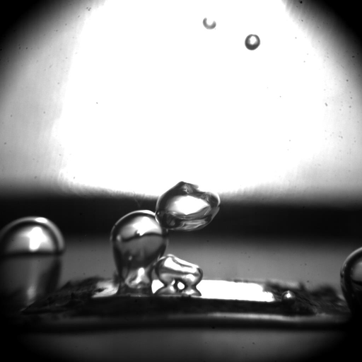
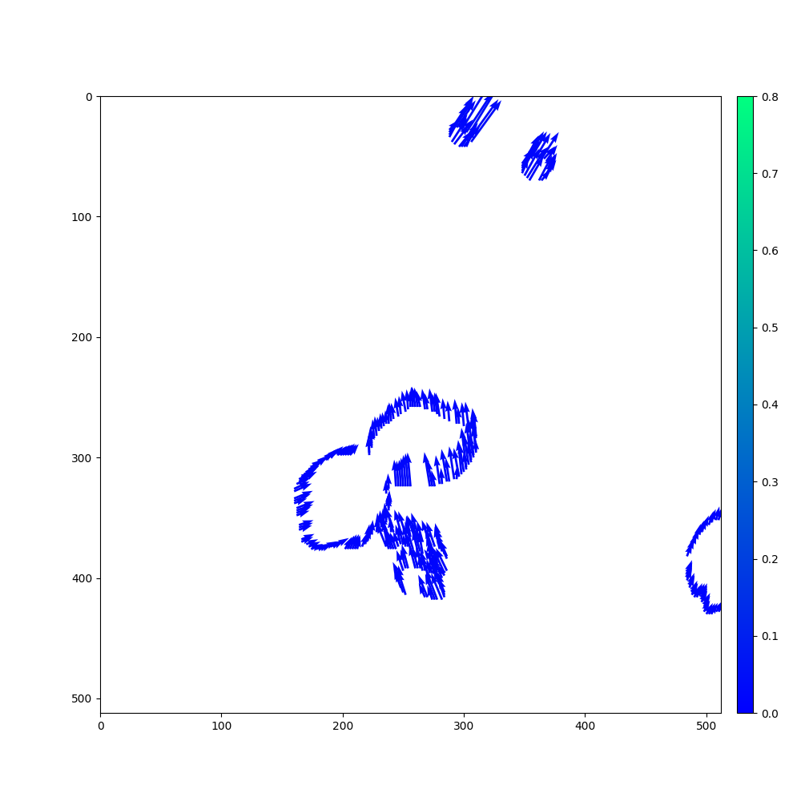
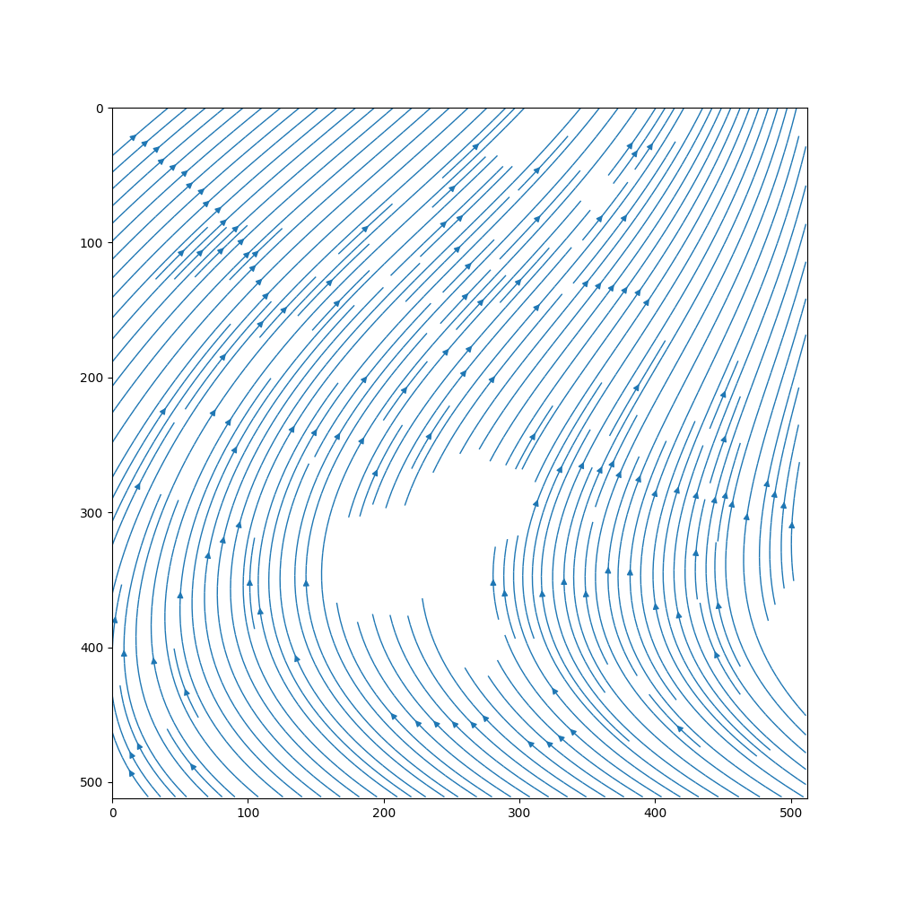

# bubble2vel

Tensorflow implementation of a PINN that predicts fluid velocities around
bubbles whose optical flow was obtained with
[`flownet2-pytorch`](https://github.com/NVIDIA/flownet2-pytorch).

<figure>

<figcaption align = "left">
  <b>Fig 1: </b>Left: Original data. Right: Preprocessed input data for model
</figcaption>
</figure>

## Usage

### Generate training & validation data

`python3 bgenerate.py -tf 100 -f ../data/PB_30W_RGB/512/30W%06d.flo`

Extracts all points along the bubble boundary and within liquid areas from the specified number (`-tf`)  of `.flo` files.

Optionally, points to specify a soft boundary condition along domain walls (`-w`) can be extracted too. 

Point arrays and domain metadata (e.g. domain size, number of frames) will be saved to `../data/` in `.h5` format.

### Train the model

`python3 bmain.py -e 5000 -f ../data/bdata.h5`

Uses the generated training and validation data (`-f`) to train the model.

The number of data (`-d`) and wall points (`-b`) can be set explicitly. If not, all available points will be used.
The number of collocation points (`-c`) should be supplied. Otherwise, a default non-zero value will be used.

Adjust the number of epochs (`-e`), batch size (`-bs`), and model architecture (e.g. `-l 50 50 50`) accordingly.

### Predict fluid flow

`python3 bpredict.py -p 50 -f ../data/bdata.h5 -n bubble2vel`

Uses the trained model (`-n`) to predict the full velocity field or only the bubble boundary (`-b`)

Specify the number of frames to predict (`-p`) and toggle the video export option (`-ev`).

<figure>

  

<figcaption align = "left">
  <b>Fig 2: </b>Left: Original vapor/fluid boundary velocities
    (`matplotlib quiver`). Right: Predicted fluid flow (`matplotlib streamplot`)
</figcaption>
</figure>

## Project structure
 
* `src/` includes PINN and util functions that load and prepare external data
* `data/` location of optical flow data for training (`.flo` format). The compressed `.h5` data files are saved here too.

During predictions and plotting the following directories will be created automatically:
* `img/` contains plots of input data, predictions as well as loss plots
* `vid/` visualization of `img/` contents with `ffmpeg`

