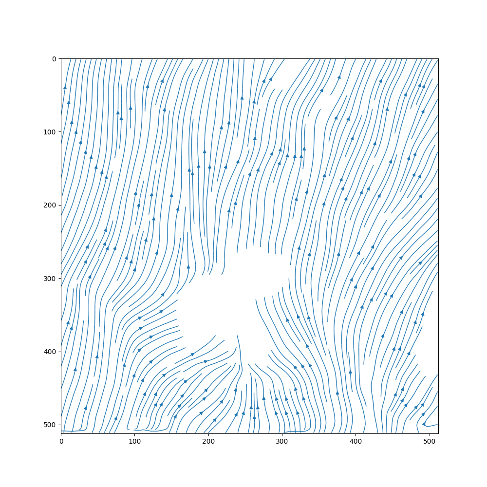

# bubble2vel

Tensorflow implementation of a PINN that predicts fluid velocities around
bubbles whose optical flow was obtained with
[`flownet2-pytorch`](https://github.com/NVIDIA/flownet2-pytorch).

<figure>

<figcaption align = "left">
  <b>Fig 1: </b>Left: Original data. Right: Preprocessed input data for model
</figcaption>
</figure>

## Usage

### Generate training & validation data

`python3 bgenerate.py -c 800000 -b 1000 -tf 399 -f ../data/PB_30W_RGB/512/30W%06d.flo`

Extracts all data and the given number of collocation and boundary points from the specified number (`-tf`)  of `.flo` files.
Collocation (`-c`) and boundary points (`-b`) are spread evenly across the input files.

Final point arrays and additional domain data will be saved to `../data/` in `.h5` format.

### Train the model

`python3 bmain.py -e 5000 -bs 128 -f ../data/bdata_512_56389.h5`

Uses the generated training & validation data (`.h5` file) to train the model.
Optional: Specify the number of epochs (`-e`) and batch size (`-bs`). Change model architecture (e.g. `-l 50 50 50`).

### Predict fluid flow

`python3 bpredict.py -p 50 -f ../data/bdata_512_56389.h5`

Uses the trained model to predict the full velocity field.
Optional: Specify the number of frames to predict (`-p`). Export predictions as video (`-ev`).

<figure>

  

<figcaption align = "left">
  <b>Fig 2: </b>Left: Original vapor/fluid boundary velocities
    (`matplotlib quiver`). Right: Predicted fluid flow (`matplotlib streamplot`)
</figcaption>
</figure>

## Project structure
 
* `src/` includes PINN and util functions that load and prepare external data
* `data/` location of optical flow data for training (`.flo` format). The compressed `.h5` data files are saved here too.

During predictions and plotting the following directories will be created automatically:
* `img/` contains plots of input data, predictions as well as loss plots
* `vid/` visualization of `img/` contents with `ffmpeg`

